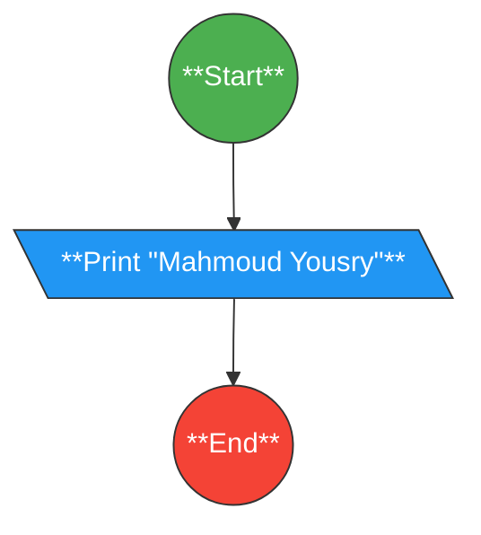
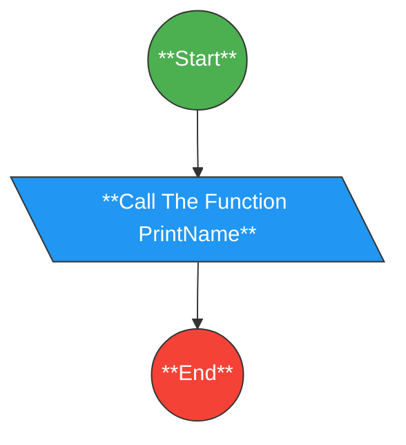

# 01 - Print Your Name

This is a simple program that prints the user's name on the screen.

## Problem-Solving Step

1. **Print `"Mahmoud Yousry"`.**

## Flowchart of the Problem

## Flowchart of the code

## Source Code

**You can view or download the C++ solution here: [Print Your Name](print-your-name.cpp)**
