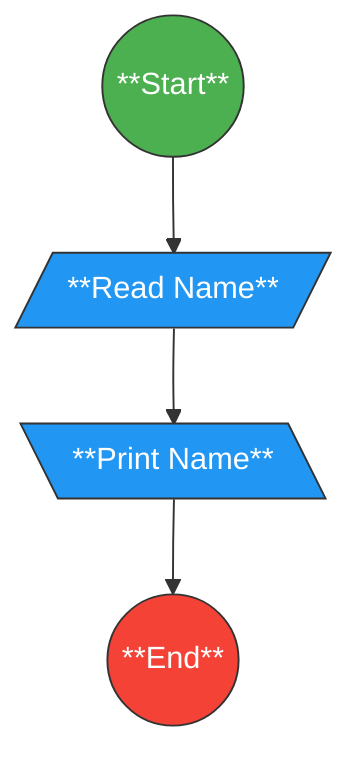
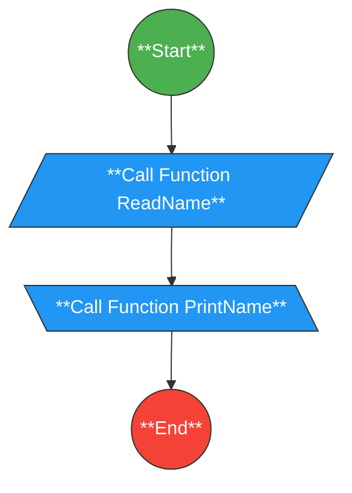

# 02 - Print Your Name (User Input)

This is a simple program that prints the user's name on the screen.

## Problem-Solving Step
1. **Get the name from the user.**
2. **Print the entered name on the screen.**

## Flowchart of the Problem

## Flowchart of the code

## Source Code
**You can view or download the C++ solution here: [Enter your name and print it](Enter-your-name-and-print-it.cpp)**
