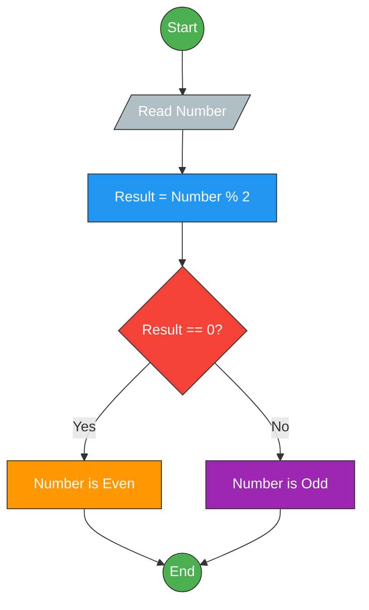
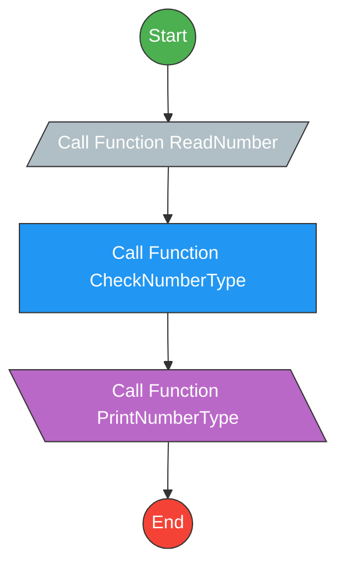

# 03 - Odd or Even Number

This is a simple program that checks whether a number entered by the user is odd or even.

## Problem-Solving Step

1. **Read** a number from the user.  
2. **Calculate**: `Result = Number % 2`. 
3. **Check** the result:  
   - If `Result == 0` → **Print** `"The Number is Even"`.  
   - Otherwise → **Print** `"The Number is Odd"`.

## Flowchart of the Problem
_______

## Flowchart of the code
_______

## Source Code

You can view or download the C++ solution here: [Odd or Even](odd-or-even.cpp)
